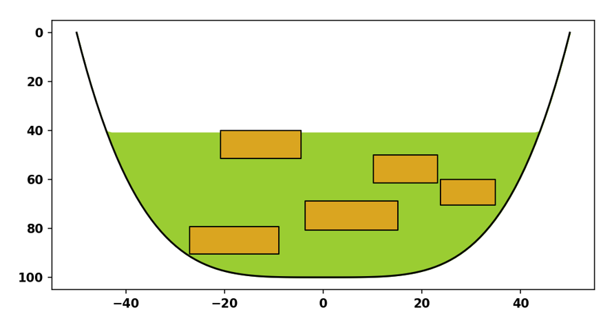

# 2D channel belt generation

Playing around with simple rule-based generation of channel belt objects
on a floodplain, as seen in a strike-oriented cross section.

## References

- Boggs, S. (2014). Principles of Sedimentology and Stratigraphy (5. ed., Pearson New International Edition). Pearson Education Limited.

- Walker, R. G. (1976). Facies model-3. Sandy fluvial systems. Geoscience Canada, 3(2), 101–109.

- Allen, J. R. L. (1965). A REVIEW OF THE ORIGIN AND CHARACTERISTICS OF RECENT ALLUVIAL SEDIMENTS. Sedimentology, 5(2), 89–191. https://doi.org/10.1111/j.1365-3091.1965.tb01561.x

- Jo, H., & Pyrcz, M. J. (2020). Robust Rule-Based Aggradational Lobe Reservoir Models. Natural Resources Research, 29(2), 1193–1213. https://doi.org/10.1007/s11053-019-09482-9

- Bristow, C. S., & Best, J. L. (1993). Braided rivers: Perspectives and problems. Geological Society, London, Special Publications, 75(1), 1–11. https://doi.org/10.1144/GSL.SP.1993.075.01.01

