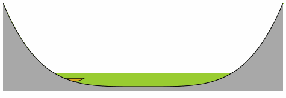
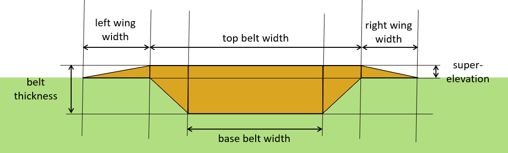

# 2D channel belt generation

Playing around with simple rule-based generation of channel belt objects
on a floodplain, as seen in a strike-oriented cross section.

## Usage

### Scripts

- 00_braided_single_object.py
- 01_braided_process.py
- 02_meandering_process.py
- 03_winged_belt_single_object.py
- 04_potential_distribution.py

### Parameters

- Valley parameters
    - width
    - depth
    - initial level

- Object geometry (braided and meandering belts)
    - aggradation
    - channel depth
    - belt elevation
    - belt width

- Object geometry (winged belts)
    - center_location
    - floodplain_elevation
    - left_wing_width
    - right_wing_width
    - base_belt_width
    - top_belt_width
    - belth_thickness
    - superelevation

- Additional process parameters (braided process)
    - topographic relief sensitivity

## Background

The original idea was to recreate figures 11 and 12 on p. 222 of Boggs (2014),
but it turned out that braided deposition wasn't so relevant to the wider
project, so now the plan is to focus on the meandering case, and to refine the
channel belt geometry and stacking rules.

From Boggs (talking about figures 11 and 12):

>Lateral migration of braided rivers leaves sheetlike or wedge-shaped
deposits of channel and bar complexes (Cant, 1982). Lateral migration
combined with aggradation leads to deposition of sheet sandstones or
conglomerates that enclose very thin, nonpersistent shales within
coarser sediments (Fig. 11).

>Migration of meandering streams, which
are confined within narrow, sandy meander belts of stream floodplains,
generate linear “shoestring” sand bodies oriented parallel to the
river course. These shoestring sands are surrounded by finer grained,
overbank floodplain sediments. Periodic stream avulsion may create new
channels over time, leading to formation of several linear sand bodies
within a major stream valley (Fig. 12).

## References

- Cant, D.J. 1982. Fluvial facies models and their application.
In Scholle, P. A., and D. Spearing (eds.).
Sandstone Depositional Environments.
Amer Assoc. Petroleum Geologists Mem. 31. 115–138.

- Boggs, S. (2014). Principles of Sedimentology and Stratigraphy (5. ed., Pearson New International Edition). Pearson Education Limited.

- Walker, R. G. (1976). Facies model-3. Sandy fluvial systems. Geoscience Canada, 3(2), 101–109.

- Allen, J. R. L. (1965). A REVIEW OF THE ORIGIN AND CHARACTERISTICS OF RECENT ALLUVIAL SEDIMENTS. Sedimentology, 5(2), 89–191. https://doi.org/10.1111/j.1365-3091.1965.tb01561.x

- Jo, H., & Pyrcz, M. J. (2020). Robust Rule-Based Aggradational Lobe Reservoir Models. Natural Resources Research, 29(2), 1193–1213. https://doi.org/10.1007/s11053-019-09482-9

- Bristow, C. S., & Best, J. L. (1993). Braided rivers: Perspectives and problems. Geological Society, London, Special Publications, 75(1), 1–11. https://doi.org/10.1144/GSL.SP.1993.075.01.01
